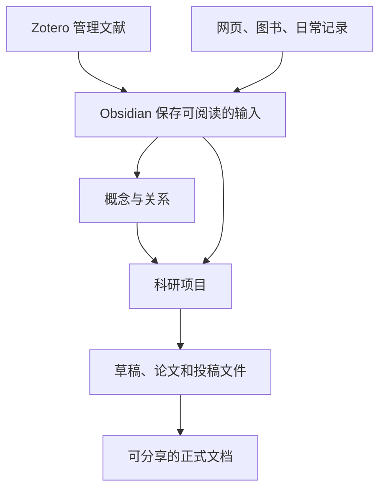

# 第一部分：产品介绍

> [!note] 开发者署名章节{>>「开发者署名章节」这个标题和下面那句话对不上——正文讲的是本部分的内容安排，跟署名没关系。读者第一眼会以为下面是作者信息。是不是想写「本部分由开发者执笔」之类的意思？<<}
> 本部分从使用场景、核心设计理念和适用人群三个方面介绍 PaperBell，并为后续教程提供统一语境。

## PaperBell 是什么

PaperBell 不是一个单独的 Obsidian 插件，而是由以下部分共同组成的科研工作环境：

1. 一套采用 CIMPO 结构的 Obsidian 示例库；
2. 一组负责输入、概念、项目、检索和输出的 PaperBell 插件；
3. Zotero、ZotLit、Pandoc 等外部工具；
4. 模板、Bases、属性约定、脚本和导出资产；
5. 一套可以按个人研究方式继续修改的工作方法。

一句话概括：

> PaperBell 帮助研究者把分散的科研材料连接成可以持续积累、可以追踪来源、最终可以用于写作的知识系统。

## PaperBell 试图解决什么问题

研究工作经常被分散在多个彼此隔离的工具里：

- 文献保存在 Zotero；
- 批注停留在 PDF；
- 灵感散落在日记和聊天记录；
- 学者与机构信息靠记忆维护；
- 项目进度保存在表格或任务软件；
- 草稿和投稿文件又位于另一个目录。

PaperBell 不要求把所有工具替换掉，而是让它们在一个明确的流程中分工：

## 为什么选择本地 Markdown

PaperBell 的主要研究数据最终落在普通文件中：

- `.md`：笔记、项目和长文场景；
- `.json`：工作流元数据；
- `.bib`：参考文献；
- 图片和 PDF：研究附件；
- `.base`：Obsidian Bases 的查询与视图定义。

这种设计的目标是降低长期迁移成本。即使将来替换某个插件，核心文字仍然可以通过普通编辑器读取。

## PaperBell 适合谁

PaperBell 更适合：

- 需要长期积累文献、概念和研究问题的学生与研究者；
- 同时管理多个科研项目的人；
- 习惯使用 Zotero，希望进入 Markdown 写作流程的人；
- 希望论文、补充材料、回复信和投稿信共用一套数据的人；
- 愿意先学习一套结构，再逐步定制工具的人。

它可能不适合：

- 只想临时记录几篇笔记、不需要项目和长文输出的人；
- 必须完全依赖手机完成工作的用户；
- 不希望管理本地文件，也不愿进行任何初始配置的人；
- 希望 AI 自动替代文献核验、学术判断和最终写作责任的人。

## 如何使用本教程

- **第二部分**是操作课：跟着做，不需要先理解所有原理。
- **第三部分**是工作流课：解释为什么这样组织。
- **第四部分**是插件手册：需要配置或排错时查阅。
- **第五部分**是维护手册：准备修改模板、属性和导出链时阅读。
- **第六部分**是故障入口：出现异常时先从症状查找。

> [!tip] 新手最重要的原则
> 不要在第一次打开示例库时就删除目录、批量移动文件或修改模板。先用测试材料完成一次闭环，再决定哪些部分适合自己的研究。

## 继续阅读

1. [核心设计理念](01-核心设计理念.md)
2. [是否适用于你](02-是否适用于你.md)
3. [PaperBell 的使用场景](03-PaperBell%20的使用场景.md)
4. [这份手册怎么读](04-这份手册怎么读.md)

---

[返回教程首页](../index.md) · [下一部分：快速上手](../02-快速上手/index.md)
