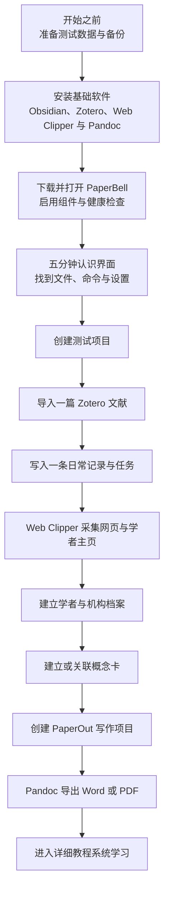

# 第二部分：快速上手

这一部分面向第一次使用 PaperBell 的读者。目标不是一次理解所有插件和字段，而是完成必要安装，并亲手验证 PaperBell 可以把一个测试项目、一篇文献、一条日常记录、一次 Web Clipper 网页采集、一位学者、一张概念卡和一份实际导出的写作成果连接起来。

> [!abstract] 快速上手回答的问题
> **软件能不能正常运行？命令在哪里？执行后产生了什么文件？这些文件能不能继续进入下一步？**
>
> 工作流为什么这样设计、字段怎样协作、有哪些替代方案和排错方法，将在[第三部分：详细教程](../03-详细教程/index.md)中解释。

{>>整个第二部分从头到尾用 `10 - Cards` / `20 - Inputs` / `30 - Metadata` / `40 - Projects` / `50 - Outputs` 指路，但一次都没说这五个编号目录是一套有名字的结构（CIMPO），读者只会当成随意的编号。建议在上面这个 callout 里补一句：「这五个编号目录对应 PaperBell 的 CIMPO 结构，现在只当成五个抽屉用即可，含义见[CIMPO 学术生涯管理框架](../03-详细教程/01-CIMPO-学术生涯管理框架.md)」。一句话 + 一个链接，既不打断上手节奏，又能让读者知道这里有设计而不是巧合<<}

## 整体路线

软件下载、首次索引和 Pandoc 工具链安装不计入闭环时间。环境准备完成后，建议为第一次练习预留 **60–90 分钟**。

## 完成后的可检查结果

| 结果 | 默认位置 | 最小验收 |
| --- | --- | --- |
| 测试项目 | `40 - Projects/<项目名>` | 项目主页包含稳定的 `acronym`，测试任务带有对应项目标签 |
| Zotero 文献笔记 | `20 - Inputs/Zotero` | 文件名、`citekey`、作者、关键词和批注区可检查 |
| 当天日记 | `30 - Metadata/DailyNote` | Thino 内容写入 `## 日程`，项目任务仍是普通 Markdown 任务 |
| Web Clipper 网页采集 | `20 - Inputs`，随后由 Inputs Bell 归位 | 通用网页剪藏成功；Scholar 模板已导入，自动路径可按 Interpreter 配置继续验收 |
| 学者与机构档案 | `30 - Metadata/Scholars`、`30 - Metadata/Institutes` | 学者、机构及二者关系可打开和核对 |
| 概念卡 | `10 - Cards/Concepts` | 概念卡能够连接测试文献、学者或输出 |
| PaperOut 项目 | `50 - Outputs/Longform` | 写作项目及 Main Manuscript 等组件已经创建 |
| Word 或 PDF | PaperOut 设置的导出位置 | Pandoc 工作流成功结束，文件可以实际打开并检查 |

## 阅读顺序

| 顺序 | 页面 | 解决的问题 | 预计用时 |
| ---: | --- | --- | ---: |
| 1 | [开始之前](01-开始之前.md) | 怎样安全试用，并准备统一测试案例 | 5–10 分钟 |
| 2 | [安装基础软件](02-安装基础软件.md) | 怎样安装两条采集入口与首次导出工具链 | 因下载速度而异 |
| 3 | [下载并打开 PaperBell](03-下载并打开PaperBell.md) | 怎样打开正确的库根目录，连接 Web Clipper 并准备导出资产 | 20–30 分钟 |
| 4 | [五分钟认识操作界面](04-五分钟认识操作界面.md) | 在哪里操作、在哪里检查文件结果 | 5 分钟 |
| 5 | [跑通第一个科研闭环](05-跑通第一个科研闭环.md) | 用同一组测试数据走完采集、管理、写作与首次导出 | 60–90 分钟 |

## 快速上手的边界

快速上手只使用最少设置，不要求第一次就配置：

- 大模型 API 与所有 AI 自动化；
- Paper Search、本地模型和大规模索引；
- 复杂 Zotero 模板、主题与界面定制；
- 首次手稿导出之外的其他 PaperOut 配方、CSL 样式和投稿级定制；
- 正式研究数据和不可恢复的批量操作。

这些能力不会阻止你建立项目、导入文献、记录日常、创建档案和概念卡。与它们不同，Web Clipper 的安装以及 Pandoc 首次导出属于本部分的完整体验，不再作为可选结果。

---

[上一部分：产品介绍](../01-产品介绍/index.md) · [返回教程首页](../index.md) · [开始：开始之前](01-开始之前.md)
