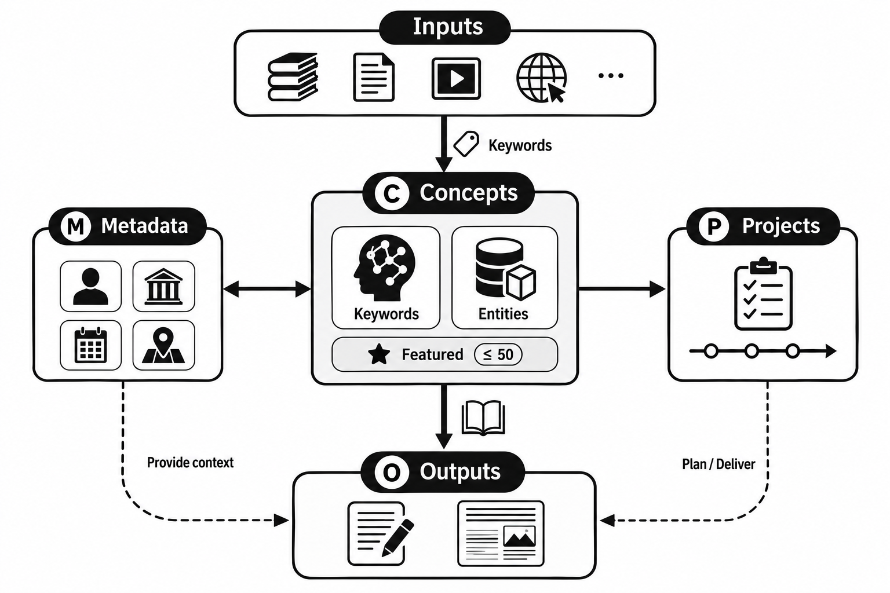

# CIMPO 学术生涯管理框架

## 为什么需要管理框架

> [!question] 学术生活的五个"根本压力"
> 每一个都对应 CIMPO 的一个字母——框架不是凭空设计，而是从这五个压力里长出来的。

| 压力 | 说的是什么 | 对应 |
| :---: | --- | :---: |
| 📥 | 信息时代，材料和参考资料**唾手可得**，多到淹没 | **I**nput |
| 🧠 | 概念是信息之上的高度抽象，是**人脑存储信息的原单元** | **C**oncept |
| 📁 | 学者常同时背着**多个长达数年**的研究项目 | **P**roject |
| 🗓️ | 繁忙日程、同行评议、学术交流——要跟上时代，又**不能被琐碎日志淹没** | **M**etadata |
| 📤 | 不发表就灭亡——**只输入不输出**，学术生活没有意义 | **O**utput |

---

## CIMPO 框架



> [!abstract] 五个单元 = 仓库里五个带编号的文件夹
> （`00 - Obsidian` 存放配置与脚本，不计入字母）

| 字母 | 单元 | 文件夹 | 一句话职责 |
| :---: | --- | --- | --- |
| **C** | Concepts 概念 | `10 - Cards` | 自我生长的 wiki 词条 + 有界核心词表 |
| **I** | Inputs 输入 | `20 - Inputs` | 论文/图书/剪藏，只带 keywords |
| **M** | Metadata 元数据 | `30 - Metadata` | 人/地/时的流水账 |
| **P** | Projects 项目 | `40 - Projects` | 长周期研究项目，锚定概念 |
| **O** | Outputs 输出 | `50 - Outputs` | 亲笔草稿与长文 → 交付物 |

> [!note]- 五个单元详解（点击展开）
> - **C — Concepts 概念**：你写作时会用到的术语与对象，沉淀成**互相引用、自我生长的 wiki 词条**——含 keyword（抽象术语 / 理论 / 方法）与 entity（模型、数据集等具体对象）两类卡。你再从 keyword 里**手工精选**出最关心的少数，标记为 featured，构成一个**有上限（约 50）的有界核心词表**（即旧版所说的"概念"）。
> - **I — Inputs 输入**：一切外部材料——论文、图书、网页剪藏。它们只携带关键词，可随信息源头自由增删。
> - **M — Metadata 元数据**：人、地、时的流水账——学者、机构、日记。它们被关键词检索、被精选关键词整合；解析输入时检测到的人 / 机构 / 时 / 地**不进 Cards**，只列入待核查清单，由你确认后落到这里。
> - **P — Projects 项目**：长周期（半年以上）的研究项目。每个项目都锚定在几个概念上，是最顶级的管理层。
> - **O — Outputs 输出**：你亲笔写下的草稿与长文本，编辑性地选取概念，最终形成交付物。

### 🔀 一条有向的流水线

各单元不是孤岛，而是一条有方向的传送带：

```
输入 ──①──► 关键词词条 ──②──► 精选(featured) ──③──► 项目 ──⑤──► 输出
                                    ▲                │
                                    └──── ④ 元数据 ⇄ 全局 ────┘
```

> [!tip] 五步流转
> 1. **输入 → 关键词词条**：每份输入的关键词在导入/解析时沉淀成互相双链的 wiki 词条（有 AI 时可自动提取）。
> 2. **关键词 → 精选**：词条层随输入自由生长；你定期从中**精选**核心关键词（featured），精选集**有数量上限**，靠人工策展 + 降级机制防止关注面膨胀。
> 3. **精选 → 项目**：用精选关键词起草项目——每个项目创建时都锚定在几个精选关键词上。
> 4. **元数据 ⇄ 全局**：日记（时间）、人和事（地点）这些流水账，被关键词检索、被精选关键词整合，既供写作时调取素材，也服务项目管理（合作者、评审专家……）。
> 5. **精选 → 输出**：精选关键词框定文章话题；定稿时通过关键词词条**反查材料**，帮助项目交付。

---

## 具体实现

### 📥 输入模块

输入模块由多个**平行、可加载或拆卸**的信息输入单元（文件夹）组成。这种低耦合保证了每个单元都能根据信息源头单独维护——因此通常每个单元都有自己的工作流和插件。

> [!info] 目前示例库维护的输入单元
> | 单元 | 来源 | 落点 |
> | --- | --- | --- |
> | 📖 读书摘录 | 豆瓣 | `20 - Inputs/Books` |
> | 🎬 影视条目 | 豆瓣 | `20 - Inputs/Movies` |
> | ✂️ 网页剪藏 | Obsidian Web Clipper | `20 - Inputs/Clippings` |
> | 📄 文献 | Zotero + ZotLit | `20 - Inputs/Zotero` |

**分工**：**抓取**由各单元自己的工具负责（QuickAdd 豆瓣宏、Web Clipper、ZotLit）；**归一化**统一交给 **Inputs Bell 插件**——它监听 `20 - Inputs/`，对每篇新笔记运行当前启用的可插拔脚本：

> [!example]- Inputs Bell 当前启用的四步流水线（点击展开）
> 1. **`normalize-frontmatter`** — 补齐 `input_type` / `title` / `authors` / `keywords`（只补不覆盖）
> 2. **`localize-images`** — 把远程图片下载到 `20 - Inputs/_assets`；当前防盗链规则为 `doubanio.com => https://www.douban.com/`
> 3. **`move-by-frontmatter`** — 以 `20 - Inputs` 为基准，按 `has:zotero-key`、`has:citekey`、来源 URL 或标签归位；其中 `tag:scholar` 指向 `/30 - Metadata/Scholars`，并排在 `tag:clip` 前
> 4. **`link-institution`** — 在 `30 - Metadata/Institutes` 建立或复用机构笔记，模板为 `00 - Obsidian/模板/机构模板pro`；未匹配时的 AI 归一化重试当前关闭（`useAiFallback: false`）
>
> `verify-zotero` 脚本已随包提供并配置为访问 `http://localhost:23119`，但**不在当前 `enabledScripts` 中**。它只处理带 Zotero key 的笔记，并保护 `read`、`source`、`important`、`keywords` 不被覆盖。

> [!success] 统一的结局
> 无论从哪个源头进来，落地后的笔记都长成同一副样子：**只带 `keywords`，不带 `concepts`**。连接的活儿留给概念一侧。

> [!warning] 别直接改脚本文件
> 脚本由插件写在 `00 - Obsidian/InputsBell/`，**升级时会被覆盖**。要改行为，请改插件设置里的脚本参数（`scriptParams`），而不是改脚本文件。

---

### 🧠 概念模块（Cards）

这一层叫 **Cards**，由三种角色构成，但**只有前两种是笔记**：

> [!note] 三种角色
> | 角色 | 是笔记? | 是什么 | 边界 |
> | --- | :---: | --- | --- |
> | **keyword** 概念词条 | ✅ | 每个关键词一张 wiki 笔记，互相 `[[双链]]`、随输入**自我生长** | 偏抽象，可自由膨胀 |
> | **entity** 实体词条 | ✅ | 具体可指称对象（模型、数据集、方法工具、研究系统） | 偏具体 |
> | **featured** 精选标记 | ❌ | 从 keyword 里**手工挑选**、标 `featured: true` | 有上限（约 50），即旧版"概念" |

> [!tip] 靠 `aliases` 收编变体，防止爆炸
> 同一个意思的关键词可能因大小写、拼写、中英文而分散——用 `aliases` 字段把变体**收编**到同一张词条里。

> [!important] 有界约束的是"精选"，不是"存在"
> 噪声关键词照样成为词条、进入索引，但**不会被精选**。于是索引可以尽情丰富，而核心关注面始终**干净、有界**。

**反查机制**：每张词条都能用自己（及 `aliases`）**反查**所有携带该关键词的输入（论文、学者）。维护只发生在 Cards 这一侧，**导入新材料零额外成本**。

> [!warning] Cards 池需要定期治理
> 巡检三件事：① 精选规模是否逼近上限 ② 有没有"谁都没引用"的孤儿词条 ③ 有没有反复出现却还没精选的高频关键词。

> [!danger] 人 / 机构 / 时 / 地**不进 Cards**
> 解析输入时若检测到它们，只写入一份**待核查清单**，由你确认后转交 Metadata 模块。

> [!info] 谁来维护这一层
> **PaperBell Cards Wrangler 插件**：读取输入笔记、用 LLM 把关键词/实体沉淀成词条、按 `aliases` 合并变体、维护双链与索引。精选与降级、是否回写关键词到输入（关 / 逐条确认 / 自动 三档），都由你掌控。

---

### 🗓️ 元信息模块

> [!note] 目前包括四类"流水账"
> | 类型 | 记录什么 | 工具 |
> | --- | --- | --- |
> | 👤 **Scholars** 学者 | 研究关键词（可从学者网页自动剪藏） | 剪藏 → 计划自动维护 |
> | 🏛️ **机构** | 位置 `location` | Map View 插件 |
> | 📅 **日记** | 时间维度 | Templater + 日记插件 + Thino |
> | 💰 **Grants** 资助 | 基金与经费，`project:` 指回项目 | wikilink |

> [!abstract] 元信息的共同点
> 它们都是**流水账**——本身不直接产出，但会被关键词检索、被概念整合，成为写作和项目管理时随手可调的素材库。
> 资助也一样：它不产出知识，却**决定了哪些项目跑得下去**。

---

### 📁 项目模块

> [!success] 每个项目一个文件夹
> 存放该项目相关的所有特殊资料，**内部结构你自己定**（方便整体迁移）。但每个文件夹必须有：
> - 一个**与显示名同名的主页笔记**（如 `40 - Projects/PaperBell/PaperBell.md`）
> - 一张 `cover.jpg`
>
> 由 **PaperBell Project Manager 插件**渲染成 Bases 里的项目卡片。

**两个身份字段**：`project` 是**显示名**（= 文件夹名），`acronym` 是**缩写**（用作标签）。

> [!important] 生命周期只有一根轴：`stage`
> 取值以创建/编辑表单提供的选项为准；发布包模板当前使用 `探索`、`进行`、`追踪`、`完成`。不要再同时维护旧版 `status` 与 `phase`。

> [!tip] 里程碑用原生 Markdown 待办
> - 必须带 `#milestone` 标签才被统计（靠标签而非标题，因为标题写法五花八门）
> - 进度 = `已完成 / (总数 − 已取消)`：`[-]` 取消的里程碑**整个移出分母**——放弃一个里程碑不该永久拖低进度条
> - 任意笔记/待办打上 `#project/<acronym>` 就被该项目收录
> 

> [!danger] 项目自己不记账——连接都是**反查**出来的
> - **交付物**：`50 - Outputs/` 里 `longform` 是**对象**（非 `true`/`false`）的笔记，用 `project: <acronym>` 指回
> 
> - **资助**：`30 - Metadata/Grants/` 里带 `grant` 标签的笔记，用 `project: "[[项目主页]]"` 指回（插件解析链接再读目标 `acronym`，链显示名或缩写都行）
>
> 所以卡片上的「交付物 N / 资助 M」是**数出来的**，项目 frontmatter 里**没有** `grants` 字段。

---

### 📤 输出模块

> [!note] 当前分为两类
> | 类型 | 特点 | 管理者 |
> | --- | --- | --- |
> | 📝 **Drafts** | 零散草稿，比较随意（`longform: false`） | — |
> | 📚 **Longform** | 正式长文写作 | **PaperOut To-Authors** 插件 |

一个 Longform **项目**就是一个文件夹，里面至少包含必选的 **Main Manuscript**；新建对话框默认只勾选主手稿，Supplementary、Cover Letter、Response Letter 是可选组件，也可稍后用“Add paper components…”补建。所选组件共享项目根目录的 `metadata.json`，Supplementary 另有就近优先的 `supplementary/metadata.json`：


```
paper-demo/
|-- metadata.json                出版元信息（作者 / 机构 / 通讯作者 / 导出模板），唯一权威来源
|-- results.json                 编译期占位符数据，正文里写 {{ summary.n }} 即可
|-- references.bib               本项目的参考文献（就近查找，优先于全局 bib）
|-- figs/                        图片
|-- Main Manuscript (Index).md   + manuscript/   （各章节）
|-- Response Letter (Index).md   + response/
|-- Cover Letter.md              （单文件草稿）
`-- supplementary/               自带 metadata.json → 图表编号加 S 前缀
```

四份草稿对应四条内置编译工作流（`PaperBell Manuscript` / `PaperBell Supplementary` / `PaperBell Response Letter` / `PaperBell Cover Letter`）；另外还有 `Default Workflow` 和 `Quick Export` 两条通用工作流。

> [!danger] 编译顺序：先主手稿
> 主手稿会抓取行号与图号，回复信才能引用「手稿第几行、图几」。

> [!info] Pandoc 基础资产与市场资产
> v5.0.1 已在 `00 - Obsidian/pandoc/` 附带基础 defaults / filters / templates / csl；插件还可从 [paperout-assets-market](https://github.com/PaperBell-Org/paperout-assets-market) 按需安装或更新其他资产。

> [!warning] 作者只写在 `metadata.json` 的 `creators` 里
> 编译时自动生成 `authors:` 块注入手稿。`30 - Metadata/Scholars/` 是你追踪的**他人**，与手稿署名是两回事。

> [!success] 闭环
> 每篇输出都在 frontmatter 里**选取概念**（`concepts:`），从而被相应概念卡的"围绕此概念的输出"反查到——**输出 → 概念** 的环就此闭合。

## 讨论

> [!quote]
> CIMPO 不是凭空造出来的——它和几种已有的知识管理框架既有**继承**也有**不同**。

### 🃏 与卡片盒笔记法（Zettelkasten）

> [!check] 继承
> **原子化的卡片 + 链接涌现**——概念卡本质上就是原子卡片。

> [!fail] 不同
> Zettelkasten 不区分"输入/输出"，也没有"项目"长周期管理层和"元数据"层。
> CIMPO 在卡片化之上，额外装了一条**有向流水线**（输入 → 概念 → 项目 → 输出），并给概念池设了**数量上限**。

### 🔄 与 IOTO 笔记法

> [!check] 继承
> 同样围绕"输入 → 输出"的转化组织工作流。

> [!fail] 三处差异
> 1. 在输入和输出之间显式立一个**概念枢纽**，而非让输入直奔输出
> 2. 把人 / 地 / 时单独抽成**元数据层**
> 3. 整套设计**面向学术生涯**定制——长周期项目、学者机构追踪、文献"引用/精读"双层处理
>

> 

### 小结

> [!abstract]
> CIMPO 想做的，**不是取代**这些框架，而是把"卡片化 + 链接"的好思想，**套进"学术生涯"这个具体场景**里：
> 多年的项目、要追的学者、读不完的文献、写不完的论文——让它们**各归其位，又彼此连通**。


---

[返回详细教程](index.md) · [下一页：管理科研项目](02-管理科研项目.md)
