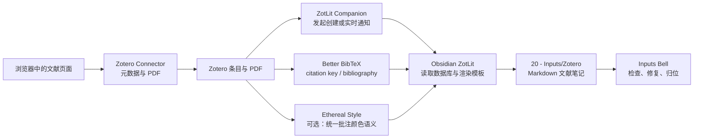

# Zotero文献导入 Obsidian

这里的“导入”包括先用 Zotero Connector 将在线文献和 PDF 保存到 Zotero，再以 Zotero 为文献权威数据源，将条目元数据、引用键、PDF 附件与批注转换成 Obsidian 中可继续编辑的 Markdown 文献笔记。

## 五个核心组件与一个可选配色插件

| 位置 | 插件 | 职责 |
| --- | --- | --- |
| 浏览器 | [Zotero Connector](../04-插件介绍/01-Obsidian外插件/01-Zotero-Connector.md) | 从网页抓取文献元数据和可访问的 PDF，保存到 Zotero |
| Zotero | [Better BibTeX](../04-插件介绍/01-Obsidian外插件/02-Better-BibTeX.md) | 管理稳定的 citation key，导出 BibTeX/BibLaTeX |
| Zotero | [ZotLit Companion](../04-插件介绍/01-Obsidian外插件/03-ZotLit-Companion.md) | 为 Zotero 提供快捷命令、协议链接和可选的实时通知 |
| Zotero（可选） | [Ethereal Style](../04-插件介绍/01-Obsidian外插件/04-Ethereal-Style.md) | 统一批注颜色语义，并与 ZotLit 的颜色分组模板配合 |
| Obsidian | [ZotLit](../04-插件介绍/02-PaperBell工作流核心插件/05-ZotLit.md) | 读取 Zotero 数据库，通过 Liquid 模板生成和更新文献笔记 |
| Obsidian | [Inputs Bell](../04-插件介绍/02-PaperBell工作流核心插件/02-Inputs-Bell.md) | 在笔记落地后做字段归一化、图片本地化、校对和归位 |



## 一、确认前置组件配置正确

这里不再重复每个插件的具体设置，只确认整条链路已经具备运行条件。某一项未通过时，先返回对应的插件介绍排查，不要直接进入文献笔记创建步骤。

| 组件 | 抓取文献前应确认 |
| --- | --- |
| [Zotero Connector](../04-插件介绍/01-Obsidian外插件/01-Zotero-Connector.md) | 浏览器扩展已启用，并能连接正在运行的 Zotero 桌面端 |
| [Better BibTeX](../04-插件介绍/01-Obsidian外插件/02-Better-BibTeX.md) | 插件已启用，citation key 格式和 `.bib` 自动导出位置已经确定 |
| [ZotLit Companion](../04-插件介绍/01-Obsidian外插件/03-ZotLit-Companion.md) | Zotero 中能看到 ZotLit 命令，并可以唤起 Obsidian |
| [Ethereal Style](../04-插件介绍/01-Obsidian外插件/04-Ethereal-Style.md)（可选） | 已按教程确定批注颜色与语义的对应关系 |
| [ZotLit](../04-插件介绍/02-PaperBell工作流核心插件/05-ZotLit.md) | Zotero 数据库连接、模板目录和文献笔记目录已经配置，`Refresh index` 能正常完成 |
| [Inputs Bell](../04-插件介绍/02-PaperBell工作流核心插件/02-Inputs-Bell.md) | 监听目录和后处理脚本已经确认；首次验收 ZotLit 时可以暂时停用 |

全部通过后，再开始抓取测试文献。这样出现问题时，能够明确判断故障发生在网页抓取、Zotero 数据、Companion 通信、ZotLit 渲染还是后处理阶段。

## 二、抓取并准备 Zotero 条目

1. 打开 Zotero 桌面端，并选中目标 collection。
2. 在浏览器中打开出版社或数据库的文献详情页，使用 Zotero Connector 保存条目和 PDF。
3. 确认父文献条目包含标题、作者、日期和期刊等基本元数据。
4. 确认 PDF 是父条目下的附件，不要把它留作孤立文件。
5. 在 PDF 中新建至少一条高亮，最好再添加一条评论，便于验证批注链路。
6. 确认 citation key 已经生成，并在后续写作期间保持稳定。

> [!important] 只选一个 citation key 权威来源
> Zotero 新版本已提供原生 citation key 字段，Better BibTeX 也会管理和导出引用键。不要让原生键、Better BibTeX 键和手工键同时变动。

## 三、连接 Zotero 标签与 Obsidian YAML

Zotero 条目中的标签不需要全部挤进 Obsidian 的 `tags`。PaperBell 会根据标签的写法，把它们分别转换成文献笔记 YAML 区中的 `tags`、`keywords`、`read`、`source` 和 `important`。

### 1. 先在 Zotero 中遵守标签约定

| Zotero 标签 | Obsidian YAML 字段 | 用途 |
| --- | --- | --- |
| `#project/PaperBell` 等以 `#` 开头的标签 | `tags` | Obsidian 标签；导入时移除开头的 `#` |
| `社会水文学` 等普通标签 | `keywords` | 输入端自由生长的检索关键词 |
| 以 `浏览`、`初读`、`精读` 结尾的标签 | `read` | 阅读进度 |
| 以 `更新`、`推荐`、`关联`、`检索` 结尾的标签 | `source` | 文献来源或发现方式 |
| `🌟星标` | `important` | 是否为重要文献 |

同一个标签只应该承担一种职责。例如 `精读` 已经进入 `read`，不会再次进入 `keywords`；`🌟星标` 只负责生成布尔值，不应污染关键词列表。

> [!important] 论文只携带关键词，不直接挂概念
> 论文属于 CIMPO 的输入层，因此只保存自由关键词 `keywords`。受控概念由 **Cards Wrangler** 通过概念卡的 `name` 和 `aliases` 统一管理，不要在这里把每个 Zotero 标签直接转换成 `concepts`。

### 2. 在 ZotLit 中配置 Managed Frontmatter

打开 **[ZotLit](../04-插件介绍/02-PaperBell工作流核心插件/05-ZotLit.md)** 设置，确认 **JavaScript Templates** 已开启，并确认 **Managed Frontmatter** 中已经存在 `tags`、`keywords`、`read`、`source` 和 `important` 五个字段。

> [!note] 与旧教程的区别
> 旧版教程通过 `zt-field.eta.md` 生成 YAML；当前 ZotLit v2 已把这部分迁移到设置页的 **Managed Frontmatter**。这里保留原有标签分流逻辑，但不再要求用户编辑旧版字段模板。

PaperBell 示例库已经预设了这五个字段，一般不需要在这里重新填写表达式。只需确认它们存在，并用上一节的标签约定做一次测试即可。

Managed Frontmatter 一共还会生成 `title`、`cate`、`authors`、`journal`、`paper_date` 和 `date`。全部 11 个字段的 JavaScript 表达式、合并方式和修改方法，见 **[ZotLit 模板自定义](../05-高级定制/01-ZotLit模板自定义.md)**。

### 3. 看懂转换结果

假设一个 Zotero 条目带有以下标签：

```text
#project/PaperBell
社会水文学
精读
检索
🌟星标
```

创建或更新文献笔记后，Obsidian YAML 应得到：

```yaml
tags:
  - paper
  - project/PaperBell
keywords:
  - 社会水文学
read:
  - 精读
source:
  - 检索
important: true
```

由于这些字段的合并方式是 `replace`，再次执行元数据更新时，ZotLit 会按 Zotero 当前标签重新生成它们。需要长期保留的分类应优先回到 Zotero 修改，不要只在 Obsidian 的这些托管字段中手工添加。

标签映射不需要单独再导出一次。完成上述准备后，直接在下一节执行第一次 Zotero → Obsidian 导出，并在生成结果中同时验收 YAML 与正文。

## 四、导出第一篇文献笔记

1. 给测试条目添加一个普通关键词、一个阅读状态和 `🌟星标`，用于同时检查标签映射。
2. 在 Zotero 中选中正确的父条目或其 PDF 附件。
3. 在 ZotLit 中执行 `Refresh index`，让刚才修改的标签和批注进入索引。
4. 使用 ZotLit Companion 提供的创建文献笔记命令，或在 Obsidian 中使用 ZotLit 文献笔记快速切换器，选择目标条目并等待 Markdown 文件创建。

预期产物是：

```text
20 - Inputs/Zotero/<citationKey>.md
```

例如：

```text
20 - Inputs/Zotero/2026_SongShuang_导出学术文档Latex版.md
```
{>>这个示例文件名在示例库里不存在，`20 - Inputs/Zotero/` 下的演示文献是中文标题（如「CIMPO：一种以输出为导向的学术知识管理方法」「卡片盒笔记法与知识的涌现」）。读者对照库里看会找不到。我没有替换成库里的名字——因为这里想演示的是「作者_年份_标题」这种 citekey 风格的文件名，而示例库的演示笔记恰好不是这个风格，两边到底以哪个为准得你来定<<}

## 五、验收生成结果

打开文献笔记，依次确认：

- Frontmatter 包含 `zotero-key` 与 `citekey`；
- 文件名与 `citekey` 一致；
- `tags`、`keywords`、`read`、`source` 和 `important` 与 Zotero 标签的分流结果一致；
- Zotero、PDF 与期刊信息可用；
- 正文包含 `%%zt-managed%%` 和 `%%/zt-managed%%`；
- `## Annotations` 下的批注数与 Zotero 一致；
- Inputs Bell 没有误删 ZotLit 生成的字段或变更错误的目录。

## 六、新增批注后如何更新

1. 在 Zotero PDF 阅读器中新建一条高亮或评论。
2. 回到 Obsidian，等待自动监视，或手动 `Refresh index`。
3. 对已有笔记执行 `Update literature note`。
4. 需要更新 Frontmatter 时，另行执行 `Update literature note metadata`。

ZotLit 只更换 `%%zt-managed%%` 区域内的正文。不要手工删除管理标记，也不要把需要长期保留的手写内容放在该区域内。

## 七、最小排错顺序

| 现象                             | 先检查                                              |
| ------------------------------ | ------------------------------------------------ |
| 搜索不到新文献                        | ZotLit 数据库路径与 `Refresh index`                    |
| 有元数据，但整个批注区不存在                 | {~~`zotlit-note.liquid.md`~>`zt-note.eta.md`~~} 是否渲染 `content`{>>⚠️ 模板文件名整体对不上：示例库 `00 - Obsidian/模板/` 下的 ZotLit 模板是 **`zt-*.eta.md`** 七个文件（`zt-note` `zt-field` `zt-annot` `zt-annots` `zt-cite` `zt-cite2` `zt-colored`），不是 `zotlit-*.liquid.md`——既不是这个前缀，也不是 liquid 后缀（ZotLit 2.x 用的是 Eta 模板引擎）。读者按 `zotlit-` 去模板目录找会一个都找不到。同样的错误在 04-插件介绍/02-.../05-ZotLit.md 和 05-高级定制/01-ZotLit模板自定义.md 里也有<<}           |
| 有 `## Annotations` 但某些批注异常     | {~~`zotlit-annotation.liquid.md`~>`zt-annot.eta.md`（单条）/ `zt-annots.eta.md`（按高亮颜色分组）~~} 及单条批注数据            |
| Frontmatter 缺失                 | JavaScript Templates 开关与 Managed Frontmatter 表达式 |
| 文件名是标题而非 citekey               | {~~`zotlit-filename.liquid.md` 的回退顺序~>ZotLit 设置里的文件名模板~~}{>>模板目录里**没有**文件名模板这个文件（七个 `zt-*.eta.md` 里不含 filename），ZotLit 2.x 的文件名规则应该存在插件设置里而不是模板文件。这条排错指引会让读者去找一个不存在的文件——具体入口请你按实际界面确认<<}                |
| ZotLit 正常，Inputs Bell 后字段或路径变了 | 暂停 Inputs Bell，单独验收 ZotLit，再逐个开启后处理脚本            |
|                                |                                                  |

> [!note] 一个容易误解的开关
> `import-annotations-as-template` 控制的是 Zotero 笔记导入时的批注段落渲染，它不是文献笔记中 `zt.annotations` 的总开关。文献笔记整个批注区消失时，不要只围绕该开关反复测试。

---

[上一章：管理科研项目](02-管理科研项目.md) · [返回详细教程](index.md) · [查看插件介绍](../04-插件介绍/index.md) · [下一篇：日常记录](04-日常记录.md)
