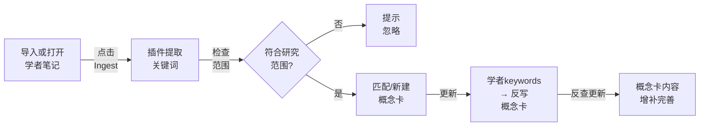

# 概念卡使用场景

## 什么是概念卡？

> [!tip] **核心理念**
> 概念卡是你个人研究领域的“语义地图”。当你阅读论文、关注学者、写作输出时，**Cards Wrangler 会自动帮你维护这个地图**，让所有资料、想法、论文彼此连接。

你的知识库分为三层：
- 📥 **输入层**（论文、学者、项目）← 原始的、自由的关键词
- 🎴 **概念层**（≈50张卡）← 你实际写作时需要的核心概念
- 📤 **输出层**（文章、草稿、提案）← 精选概念的组合

这样做的好处：
- ✅ 关键词不会爆炸失控
- ✅ 相关资料自动聚集（论文、学者、想法）
- ✅ 写作时快速找到参考资料
- ✅ 看到自己研究主题的变化历程

---

## 📋 概念卡的结构

### 一张标准的概念卡长这样：

```yaml
---
name: 社会水文学
aliases:
  - sociohydrology
ch: 社会水文学
framework:
keywords:
  - coupled human-water systems
  - flood
  - levee
tags:
  - concept
---

## Description

> [!quote]
> 社会水文学研究人与水耦合系统的协同演化。
> （这部分是**你自己写的**，不会被插件覆盖）

## 相关论文

![[概念反查.base#相关论文]]

## 相关学者

![[概念反查.base#相关学者]]

## 围绕此概念的输出

![[概念反查.base#围绕的输出]]

## 相关想法
...
```


> [!info] **字段说明**
> | 字段 | 用途 | 谁编辑 |
> |------|------|--------|
> | `name` | 概念的标准名 | 初建时你或AI |
> | `aliases` | 同义词、缩写、其他表述 | 你或AI |
> | `ch` | 中文名（如果name是英文） | 你或AI |
> | `keywords` | **关键的钩子** — 论文/学者里出现这些词，就算作这个概念 | AI维护 |
> | `Description` | 概念的定义和背景 | **你来写**，这是唯一AI不会覆盖的部分 |
> | 其他反查块 | 自动拉取相关资料 | 插件自动维护 |

---

## 🔄 Cards Wrangler 的三大工作场景


### 场景1️⃣ 「读完一篇论文」— 单篇提取

**你的操作**
1. 导入论文到 `20 - Inputs/Zotero/`（ZotLit 自动生成）
2. 阅读后，在文件中点击「**Ingest current note**」

**插件自动做**
1. ✅ 读取论文内容和现有关键词
2. ✅ 检查是否符合你的研究范围
3. ✅ 匹配现有概念卡（不用重复建卡）
4. ✅ 新建缺失的概念卡
5. ✅ 反写论文的 `keywords` 字段
6. ✅ 更新相关概念卡，记录到素材来源

> [!example]
> - 你导入论文《Human-Water Coevolution in Socio-Hydrology》
> - 插件识别出：`socio-hydrology`, `water systems`, `flood`
> - 发现已有 `socio-hydrology` 卡，但 `water systems` 需要新建
> - 自动创建并链接，论文自动出现在两张卡的「相关论文」里

---

### 场景2️⃣ 「批量导入一堆资料」— 批量制作

**你的操作**
1. 一次性导入多篇论文或整理多个学者
2. 在文件夹级别点击「**Ingest folder…**」

**插件自动做**
1. ✅ 逐篇提取概念关键词（不立即写入库）
2. ✅ 汇总所有概念，去重
3. ✅ 一次性新建批量概念卡
4. ✅ 建立概念之间的关联（近义、相关等）
5. ✅ 统一反写所有资料的 `keywords` 字段
6. ✅ 一次性更新概念卡的素材内容

> [!success]
> 这样比一篇篇来快得多，也能发现单篇看不到的模式。

---

### 场景3️⃣ 「论文自带关键词」— 论文快速通道

**背景**
- 从 Zotero 导入的论文通常已经有标签（如 `#flood`, `#SDGs`）
- 这些标签已经代表论文的主题

**插件自动做**
1. ✅ 识别这是一篇论文（来自 `Inputs/Zotero/` 或有 `#paper` 标签）
2. ✅ **跳过 scope 检查**（既然 Zotero 里有，就信任）
3. ✅ 直接进入概念写入流程
4. ✅ 额外扫一遍论文内容，看是否漏掉关键词
5. ✅ 反写 `keywords`，更新概念卡

> [!tip]
> 用这个流程导入 Zotero 收藏，最快速、自动化程度最高。

---

## 🎯 如何使用：三个场景的完整步骤

### 👤 「关于一位学者」的概念提取



**实际操作**
1. 打开学者笔记（如 `30 - Metadata/Scholars/方域`）
2. 右上角菜单 → **Cards Wrangler: Ingest current note**
3. 等待处理，看处理结果摘要
4. 点击「✅ Apply」应用更改
5. 概念卡里就会新增「相关学者」条目

---

### 📚 「处理一篇新论文」的完整流程

> [!workflow]
> 
> **预检 (前置)**
> - 论文已在 Zotero 中，ZotLit 生成了笔记
> - 或者你手动放在 `20 - Inputs/` 目录
> 
> **步骤1: 提取概念**
> - 打开论文笔记 → **Cards Wrangler: Ingest current note**
> - 插件读取 frontmatter + 内容
> - 输出：你此篇论文的核心主题
> 
> **步骤2: 验证（可选）**
> - 看一遍建议的新概念，觉得有什么不对？
> - 可以手动调整 `keywords` 字段再重新运行
> 
> **步骤3: 应用**
> - 点「Apply」，插件自动：
>   - 新建缺失的概念卡
>   - 更新现有卡的 keywords hook（如果论文的关键词是新的）
>   - 论文自动出现在这些概念卡的「相关论文」里
> 
> **步骤4: 审阅（可选）**
> - 打开相关概念卡，看“相关论文”块
> - 该论文应该已列出 ✓

---

### 🏗️ 「整个项目的批量处理」

**场景**：你新起一个项目，导入了 15 篇相关论文和 8 位学者

**最优路线**

| 阶段          | 操作                               | 时间   |
| ----------- | -------------------------------- | ---- |
| **1. 快速扫描** | 选中论文/学者，运行 `Ingest current note` | 5min |
| **2. 去重汇总** | 插件汇总所有关键词，列出候选概念                 | 自动   |
| **3. 你的审阅** | 看候选概念列表，删除不相关的                   | 5min |
| **4. 批量建卡** | Apply → 所有概念卡一次性创建               | 自动   |
| **5. 关联优化** | 插件建立概念间的关系                       | 自动   |
| **6. 反写**   | 所有论文/学者的 keywords 同步更新           | 自动   |

> [!success] **结果**
> - 15 篇论文 + 8 位学者
> - ≈12-18 张新概念卡（去重后）
> - 每张卡的「相关论文」、「相关学者」自动填充
> - 你的 keywords 字段统一更新
> - **总耗时**：15 分钟（无需手动逐一映射）

---

## ⚙️ 概念卡治理 — 保持池子不爆炸

> [!warning] **问题**
> 如果概念无限增长，到 200 张卡时就失控了。

**Cards Wrangler 的解决方案**：**需求驱动 + 定期治理**

### 为什么概念不会爆炸？

因为你**只有在写作时**才会新建概念卡。一篇论文的关键词多得是（100+），但你整个研究生涯可能只写 10-20 篇文章，那就只需要 30-50 个概念卡。

### 定期治理流程

**每个月一次**，打开 `Cards/概念池治理.md`，运行「**Govern Concepts**」

```
插件自动生成建议：

❌ 孤立概念（无资料引用，也没被文章写过）
   → 建议合并或删除
   
🪝 高频但未关联的关键词
   → 建议 hook 到某个现有概念
   
💡 相关关键词集群
   → 建议建立新概念（你来决定要不要）
   
⚠️ 概念池 >50 个了
   → 强制要求合并/删除
```

**你只需**：看一遍建议 → 选择接受/拒绝 → 点「Apply」

> [!info] **治理规则**
> - **入口**：只有写作才能触发新概念的创建
> - **防漏**：关键词 hook 把散乱的输入词连接到概念
> - **出口**：无人使用的概念定期合并

---

## 📌 最佳实践

### ✅ DO：

| 做这些                            | 原因           |
| ------------------------------ | ------------ |
| 👉 导入论文时运行 Ingest current note | 自动同步，省手动     |
| 👉 保持 `Description` 手写         | 这是你对概念的理解    |
| 👉 定期跑治理流程                     | 控制概念池大小      |
| 👉 使用 Zotero 标签                | 导入就能快速制卡     |
| 👉 在输出里选择概念                    | 概念卡才能链接到你的产出 |

### ❌ DON'T：

| 避免这些 | 为什么 |
|---------|--------|
| ❌ 手动在 keywords 加太多 | 插件可能覆盖，造成冲突 |
| ❌ 用关键词替代概念卡 | keyword 是自由的，会爆；concept 是受控的 |
| ❌ 创建概念卡但从不写文章用 | 插件会标记为孤立，建议删除 |
| ❌ 忽视治理提示 | 池子会失控 |

---

## 🚀 一日之用

### 早上：导入新资料

```
1. ZotLit 导入 3 篇新论文
   ↓
2. 对导入的论文逐篇运行 `Ingest current note`
   ↓
3. 看提示 → Apply
   ↓
4. 回到工作，卡已建好，概念已关联 ✓
```

### 下午：写文章

```
1. 打开 Outputs/Draft/MyPaper.md
   ↓
2. 在 frontmatter 里选择 concepts:
   - [[socio-hydrology]]
   - [[flood risk]]
   ↓
3. Cards Wrangler 自动在这两张概念卡的
   「围绕此概念的输出」里添加你的文章 ✓
```

### 月底：整理

```
1. 打开 Cards/概念池治理.md
   ↓
2. 运行「Govern」
   ↓
3. 看建议 → 接受你同意的 → Apply
   ↓
4. 概念池保持优化状态 ✓
```

---

## 常见问题

> [!faq]- 为什么一篇论文可以对应多个概念卡？
> 因为一篇论文常常涉及多个主题。比如一篇论文既讲“气候适应”又讲“灾难治理”，那就自然对应两张卡。插件会一次性完成映射。

> [!faq]- 如果关键词很多，全部都会变成概念卡吗？
> **不会**。只有“有人写过”的关键词才能变成概念卡。其他高频关键词会被 hook 到现有概念上。

> [!faq]- 我删了一个概念卡，相关资料会丢吗？
> **不会**。论文、学者笔记里的原文和 keywords 不变。只是失去了那个组织视角。

> [!faq]- 概念的描述被插件改了怎么办？
> 我们在 Description 标题下加了 callout 框，**这里面的内容插件永远不会覆盖**。你的思考是安全的。

> [!faq]- Zotero 标签和概念卡 keywords 有什么区别？
> - **Zotero 标签** = 自由、可以很多
> - **概念卡 keywords** = 其中一部分被 hook 了，关联到现有概念

---

## 更多资源

- 📖 [管理科研项目](02-管理科研项目.md) — 如何创建项目并关联项目任务
- 📊 [[00. 概念墙.base|概念墙]] — 你的完整概念库（含「精选概念」「概念挂靠词」视图）
- 🔗 [[概念反查.base|概念反查]] — 从单张概念卡反查相关论文、学者与输出

---

[上一章：追踪学者和组织](05-追踪学者和组织.md) · [返回详细教程](index.md) · [下一篇：PaperOut To-Authors 使用指南](07-PaperOut%20To-Authors%20使用指南.md)
