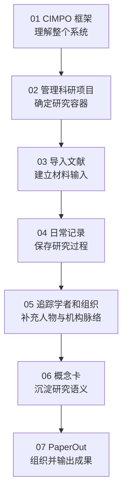

# 第三部分：详细教程

本部分不是插件功能的逐项罗列，而是一条从“建立研究结构”到“形成可交付成果”的完整学习路线。你将先理解 PaperBell 如何用 CIMPO 组织学术生涯，再依次完成科研项目管理、文献导入、日常记录、学者与组织追踪、概念卡和 PaperOut 工作流。

> [!info] 第一次打开 PaperBell？
> 请先完成[第二部分：快速上手](../02-快速上手/index.md)，确认软件安装、插件启用和最小科研闭环均能正常运行，再回到这里系统理解各工作流。

> [!abstract] 本部分的目标
> 把项目、文献、研究过程、学者与组织、概念和输出连接起来，使它们不只是分别存放在不同文件夹中，而是共同服务于一项持续推进的研究。

## 完成本部分后，你将能够

- 建立带有稳定项目 ID 的科研项目，并连接散落在全库中的任务；
- 将 Zotero 文献、PDF 和批注转换为结构统一的 Obsidian 文献笔记；
- 用日记持续捕获研究现场中的想法、判断、问题和行动；
- 自动或手动建立需要长期关注的学者与组织档案；
- 将分散在文献和研究记录中的关键词沉淀为可复用的概念卡；
- 用 PaperOut 组织长文项目，并将研究积累转化为 PDF、Word 等交付物。

## 为什么按照这个顺序

先建立项目，是为了让后续的文献、任务、日记和输出都有明确归属，而不是从积累大量材料开始。文献和日常记录提供持续输入，学者与组织档案补充研究共同体脉络，概念卡再将这些分散材料组织成稳定的个人知识结构，最终由 PaperOut 转化为论文和其他交付物。

## 章节导览

| 阶段 | 教程 | 主要解决的问题 | 完成后的结果 |
| --- | --- | --- | --- |
| 01 | [CIMPO 学术生涯管理框架](01-CIMPO-学术生涯管理框架.md) | PaperBell 为什么这样划分目录和数据 | 理解概念、输入、元数据、项目与输出之间的关系 |
| 02 | [管理科研项目](02-管理科研项目.md) | 研究资料和任务应归属于哪里 | 建立项目主页、稳定项目 ID 和项目任务关系 |
| 03 | [Zotero文献导入 Obsidian](03-Zotero文献导入Obsidian.md) | 怎样把 Zotero 文献和批注带入 Obsidian | 获得可继续整理、链接和引用的文献笔记 |
| 04 | [日常记录](04-日常记录.md) | 怎样保存研究过程中的想法和行动 | 建立可捕获、可回顾并能连接项目的日记记录 |
| 05 | [追踪学者和组织](05-追踪学者和组织.md) | 怎样长期维护重要研究主体的信息 | 建立规范的学者与机构档案，并连接相关文献 |
| 06 | [概念卡使用场景](06-概念卡使用场景.md) | 怎样把分散关键词沉淀成知识结构 | 建立个人研究领域的概念地图 |
| 07 | [PaperOut To-Authors 使用指南](07-PaperOut%20To-Authors%20使用指南.md) · [协作与使用场景](07-PaperOut%20协作与使用场景.md) | 怎样组织长文并完成正式输出 | 建立写作项目并导出 PDF 或 Word |

## 推荐阅读方式

- **已经完成快速上手，准备系统学习**：按照 01—07 顺序阅读，并为每一章完成一次最小测试；
- **已经完成基础配置**：直接进入当前需要的工作流，再沿页面中的链接查阅相关插件；
- **只需要安装、配置或排错**：前往[第四部分：插件介绍](../04-插件介绍/index.md)，按组件查找设置与边界；
- **准备正式使用自己的资料**：先用测试项目、测试文献或测试日记验收，再处理正式研究数据。

详细教程负责说明“一项科研任务怎样从头到尾完成”；插件介绍负责说明“某个组件怎样安装、配置和排错”。两部分相互链接，但不重复维护同一套操作步骤。

> [!tip] 开始学习
> 从 [CIMPO 学术生涯管理框架](01-CIMPO-学术生涯管理框架.md) 开始，先理解 PaperBell 如何组织科研资料，再进入具体工作流。

---

[返回教程首页](../index.md)

