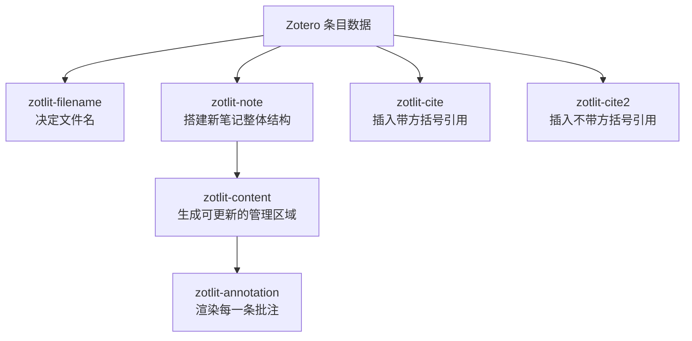

# ZotLit 模板自定义

ZotLit 模板决定 Zotero 数据进入 Obsidian 后“长什么样”：文献笔记叫什么名字、正文包含哪些区域、不同颜色的批注如何分组，以及插入引用时使用什么格式。

本章先介绍 ZotLit v2 的模板结构，再完整说明 PaperBell 当前正在使用的六个 Liquid 模板。当前实测版本为 `2.0.0-beta.4`；预发布版本的界面和字段可能变化，操作时应同时参考 [ZotLit 官方模板说明](https://zotlit.aidenlx.site/docs/concepts/how-templates-work)。

## 一、当前配置基线

| 项目 | PaperBell 当前配置 |
| --- | --- |
| 模板语言 | Liquid |
| 模板目录 | `00 - Obsidian/模板` |
| 文献笔记目录 | `20 - Inputs/Zotero` |
| 模板文件 | 6 个 `zotlit-*.liquid.md` |
| Managed Frontmatter | 11 个 JavaScript 表达式字段 |
| JavaScript Templates gate | 已开启 |

> [!important] Liquid 与 JavaScript gate 是两件事
> 六个 `.liquid.md` 模板本身不依赖 JavaScript Templates gate。当前需要该开关，是因为 Managed Frontmatter 使用了 JavaScript 表达式。不要因为看到 gate 已开启，就把旧版 `<% ... %>` JavaScript/Eta 代码直接粘贴进 Liquid 文件。

## 二、六个模板如何协作



| 模板文件 | 负责什么 | 什么时候使用 |
| --- | --- | --- |
| `zotlit-filename.liquid.md` | 文献笔记文件名 | 首次创建笔记 |
| `zotlit-note.liquid.md` | 新笔记的整体正文骨架 | 首次创建或强制覆盖 |
| `zotlit-content.liquid.md` | ZotLit 管理的正文区域 | 创建及更新文献笔记 |
| `zotlit-annotation.liquid.md` | 一条批注的具体格式 | `content` 循环渲染批注时 |
| `zotlit-cite.liquid.md` | 主引用格式 | 插入普通引用时 |
| `zotlit-cite2.liquid.md` | 备用引用格式 | 使用第二引用命令时 |

其中最重要的连接是：

```liquid

```

它必须出现在 `zotlit-note.liquid.md` 中。缺少这行时，新笔记虽然可能还有表格和 Frontmatter，但 `content` 不会运行，批注及 `%%zt-managed%%` 管理区域都会消失。

## 三、如何开始自定义

1. 打开 **设置 → ZotLit → Templates**。
2. 确认模板目录为 `00 - Obsidian/模板`。
3. 在要修改的模板旁点击“创建可编辑模板文件”，也可以一次生成全部六个文件。
4. 修改前自行保存一份模板副本，方便出现问题时回退。
5. 保存模板后，新建一篇测试笔记，或者对现有测试笔记运行 `ZotLit: Update literature note`。
6. 检查 Frontmatter、三列表格、管理区域、批注数量、颜色分组及引用格式。

ZotLit 会监听模板目录，保存后通常不需要重启 Obsidian。官方的具体操作步骤见 [Customize a template](https://zotlit.aidenlx.site/docs/how-to/customize-a-template)。

## 四、Liquid 最小语法

### 输出字段

```liquid
{{ zt.title }}
{{ zt.citationKey }}
```

### 条件判断

```liquid

{{ zt.publicationTitle }}

```

### 循环

```liquid



```

### 过滤器

```liquid
{{ zt.citationKey | default: zt.DOI | default: zt.title }}
```

### 组合子模板

```liquid


```

不确定 `zt` 中有哪些字段时，打开一篇文献笔记并运行 `ZotLit: Open template data explorer`。字段含义和更多语法可查阅 [Template syntax](https://zotlit.aidenlx.site/docs/reference/templates/syntax) 与 [Template Data Explorer](https://zotlit.aidenlx.site/docs/how-to/explore-template-data)。

> [!warning] Markdown 表格中的竖线
> Liquid 过滤器也使用 `|`，如果把带过滤器的表达式直接放进 Markdown 表格，Obsidian 可能把它误认为新的列。应先在表格外使用 `assign` 计算结果，再把变量放进单元格。PaperBell 的 `zotlit-note.liquid.md` 已采用这种写法。

## 五、PaperBell 当前六个模板

以下代码是当前生效版本的结构快照。

### 1. 文件名：`zotlit-filename.liquid.md`

```liquid
{{ zt.citationKey | default: zt.DOI | default: zt.title | default: zt.key }}
```

回退顺序为：

1. citation key；
2. DOI；
3. 文献标题；
4. Zotero item key。

`` 只在文件名发生冲突时追加随机后缀。正常情况下，文件名会直接使用 citation key，例如 `2026_SongShuang_导出学术文档Latex版.md`。

### 2. 整体骨架：`zotlit-note.liquid.md`

```liquid


| Zotero | File | Journal |
| --- | --- | --- |
| [Zotero]({{ zt.backlink }}) | {{ file_links }} | [{{ zt.publicationTitle }}]({{ zt.url }}){{ zt.publicationTitle }}{{ zt.url }} |


```

它生成三列表格：

- **Zotero**：返回 Zotero 条目的链接；
- **File**：PDF 等附件链接；
- **Journal**：期刊名称及网页链接。

附件过滤器先在表格外计算为 `file_links`，因此不会把三列表格错误拆成六列。

### 3. 管理区域：`zotlit-content.liquid.md`

```liquid

## Notes


- {{ note.noteLink }}



## Annotations















### {{ label }}











### {{ group.name }}







```

该模板做三件事：

1. 导入并链接 Zotero 子笔记；
2. 按黄色、红色、绿色、蓝色、紫色、洋红色、橙色、灰色的顺序组织批注；
3. 将未识别的新颜色放进兜底分组，避免因为颜色表变化而静默丢失批注。

如果要把“黄色”改成“前言”或其他阅读语义，只需修改 `assign label` 的值，不要修改 `yellow` 这个 `colorName`。

### 4. 单条批注：`zotlit-annotation.liquid.md`

```liquid

[!{{ zt.colorName }}] Page {{ zt.pageLabel }}

{{ zt.imgLink | embed }}{{ zt.text }}

---
{{ zt.comment }}









#{{ tag_list | join: " #" }}

```

每条批注会生成：

- 以 `colorName` 命名的 Callout；
- PDF 页码；
- 图片批注或高亮正文；
- Zotero 中填写的评论；
- 批注标签。

`[!yellow]` 等 Callout 能否显示为对应颜色，还取决于 Obsidian 主题或 CSS snippet。模板负责写出 Callout 类型，不直接控制最终视觉样式。

### 5. 主引用：`zotlit-cite.liquid.md`

```liquid
[]
```

输出 Pandoc 方括号引用，例如：

```markdown
[@Smith2024; @Wang2025, p. 12]
```

### 6. 备用引用：`zotlit-cite2.liquid.md`

```liquid

```

它与主引用使用同样的数据处理逻辑，但不自动添加最外层方括号，适合需要自行组合句子或引用结构的场景。

## 六、Managed Frontmatter 与正文模板的边界

PaperBell 的 Frontmatter 不是写在 `zotlit-note.liquid.md` 中，而是在 ZotLit 设置中单独管理。目前共有 11 个字段，完整配置快照如下。

### 当前 Managed Frontmatter 完整配置

以下是 PaperBell 当前实际使用的配置快照。`expr` 中保存的是 JavaScript 表达式，`merge: "replace"` 表示更新时用新结果替换原字段。

```json
{
  "note.frontmatter-fields": [
    {
      "key": "title",
      "expr": "zt.title || \"\"",
      "merge": "replace",
      "language": "javascript"
    },
    {
      "key": "citekey",          
      "expr": "zt.citationKey || \"\"",
      "merge": "replace",
      "language": "javascript"
    },
    {
      "key": "tags",
      "expr": "[\"paper\", ...(zt.tags || []).filter(t => t.name && t.name.startsWith('#')).map(t => t.name.slice(1))]",
      "merge": "replace",
      "language": "javascript"
    },
    {
      "key": "cate",
      "expr": "\"论文\"",
      "merge": "replace",
      "language": "javascript"
    },
    {
      "key": "concepts",
      "expr": "(zt.tags || []).filter(t => t.name && !t.name.startsWith('#') && !t.name.includes('⭐') && !t.name.includes('🌟') && !['更新','推荐','关联','检索','浏览','初读','精读','星标'].some(e => t.name.endsWith(e))).map(t => t.name)",
      "merge": "replace",
      "language": "javascript"
    },
    {
      "key": "read",
      "expr": "(zt.tags || []).filter(t => t.name && ['浏览','初读','精读'].some(e => t.name.endsWith(e))).map(t => t.name)",
      "merge": "replace",
      "language": "javascript"
    },
    {
      "key": "source",
      "expr": "(zt.tags || []).filter(t => t.name && ['更新','推荐','关联','检索'].some(e => t.name.endsWith(e))).map(t => t.name)",
      "merge": "replace",
      "language": "javascript"
    },
    {
      "key": "authors",
      "expr": "(zt.authors || []).map(a => a.fullName || a.literal || \"\").filter(Boolean)",
      "merge": "replace",
      "language": "javascript"
    },
    {
      "key": "journal",
      "expr": "zt.publicationTitle || \"\"",
      "merge": "replace",
      "language": "javascript"
    },
    {
      "key": "paper_date",
      "expr": "(function(d){ if (!d) return \"\"; if (d.kind === \"year\") return d.year != null ? Number(d.year) : \"\"; return d.raw || \"\"; })(zt.date)",
      "merge": "replace",
      "language": "javascript"
    },
    {
      "key": "date",
      "expr": "(function(d){ if (!d) return new Date().toISOString().slice(0, 10); if (typeof d === \"string\" || typeof d === \"number\") return new Date(d).toISOString().slice(0, 10); if (d.epochMilliseconds != null) return new Date(d.epochMilliseconds).toISOString().slice(0, 10); if (d.year != null) return d.year + \"-\" + String(d.month || 1).padStart(2, \"0\") + \"-\" + String(d.day || 1).padStart(2, \"0\"); return new Date().toISOString().slice(0, 10); })(zt.dateModified)",
      "merge": "replace",
      "language": "javascript"
    },
    {
      "key": "important",
      "expr": "(zt.tags || []).some(t => t.name === '🌟星标')",
      "merge": "replace",
      "language": "javascript"
    }
  ]
}
```

### 11 个字段分别负责什么

| 字段 | 数据从哪里来 | 在 PaperBell 工作流中的作用 |
| --- | --- | --- |
| `title` | Zotero 条目的标题 | 作为文献笔记的可读标题，供搜索、列表和引用信息展示 |
| `citekey` | Zotero 条目的标识符 | 作为每篇笔记独一无二的标识符，方便后续 pandoc 引用 |
| `tags` | 以 `#` 开头的 Zotero 标签；导入时移除 `#`，并自动加入 `paper` | 转换成 Obsidian 原生标签。例如 `#project/PaperBell` 会变成 `project/PaperBell`，用于项目或主题筛选 |
| `cate` | 固定值“论文” | 标明这是一篇论文笔记，便于和图书、网页剪藏等其他输入类型区分 |
| `concepts` | Zotero 中不带 `#` 的普通标签，同时排除阅读状态、来源和星标 | 保存输入端自由生长的关键词；它是文献与概念卡建立联系的主要入口 |
| `read` | 以“浏览”“初读”“精读”结尾的 Zotero 标签 | 记录阅读进度，方便筛选尚未精读或已经完成阅读的文献 |
| `source` | 以“更新”“推荐”“关联”“检索”结尾的 Zotero 标签 | 记录这篇文献是怎样被发现的，例如期刊更新、他人推荐或主动检索 |
| `authors` | Zotero 作者列表中的完整姓名 | 供学者档案和 `论文检索.base` 按姓名或别名反查相关论文 |
| `journal` | Zotero 的期刊或出版物名称 | 用于按期刊筛选文献，并在文献笔记顶部展示出处 |
| `paper_date` | Zotero 的发表日期或年份 | 表示论文真正的出版时间，用于时间排序和引用核对 |
| `date` | Zotero 条目的最后修改日期 | 表示本地元数据最近一次发生变化的日期，不等同于论文发表时间 |
| `important` | 是否存在完全匹配的 `🌟星标` 标签 | 转换成 `true/false`，用于筛选需要优先阅读或反复引用的重要文献 |

可以把这 11 个字段理解为三组：

1. **文献身份**：`title`、`cate`、`authors`、`journal`、`paper_date`、`date`；
2. **Zotero 标签分流**：`tags`、`keywords`、`read`、`source`、`important`；
3. **后续连接**：`authors` 连接学者档案，`keywords` 连接概念卡，`tags` 连接项目或 Obsidian 的其他主题系统。

### 与文献导入工作流如何呼应

在 [Zotero文献导入 Obsidian](../03-详细教程/03-Zotero文献导入Obsidian.md) 中，用户先在 Zotero 条目上添加标签，再由 Managed Frontmatter 完成分流。例如：

```text
Zotero 标签
#project/PaperBell · 社会水文学 · 精读 · 检索 · 🌟星标
```

更新文献笔记元数据后，会得到：

```yaml
tags:
  - paper
  - project/PaperBell
keywords:
  - 社会水文学
read:
  - 精读
source:
  - 检索
important: true
```

这些字段随后进入不同工作流：

- `authors` 会被 [追踪学者和组织](../03-详细教程/05-追踪学者和组织.md) 中的学者检索使用；
- `keywords` 会被 [概念卡使用场景](../03-详细教程/06-概念卡使用场景.md) 用作论文与概念卡之间的连接点；
- `tags` 可以把文献挂到某个项目或 Obsidian 主题标签下；
- `read`、`source` 和 `important` 负责阅读安排、来源追踪与优先级筛选。

> [!important] Zotero 是这些托管字段的上游数据源
> 当前 11 个字段全部使用 `merge: "replace"`。执行 `Update literature note metadata` 时，ZotLit 会根据 Zotero 当前数据重新生成字段。因此需要长期保留的标签和状态应优先在 Zotero 中修改，而不是只在 Obsidian YAML 中手工添加。

> [!note] 这是配置快照，不是单个表达式
> 不要把整段 JSON 粘贴到某一个字段中。应在 ZotLit 的 Managed Frontmatter 设置里逐项建立 `key`，并将对应的 `expr` 内容填入该字段的 JavaScript 表达式位置。

修改正文模板后运行 `Update literature note`；只修改上述字段表达式时运行 `Update literature note metadata`。二者不要混淆。

## 七、安全修改与验收顺序

1. 将当前六个模板复制到自己选择的临时备份位置。
2. 每次只修改一个模板槽位。
3. 在 Zotero 测试条目中准备文字高亮、评论、图片批注和不同颜色批注。
4. 在 ZotLit 中执行 `Refresh index`。
5. 删除旧测试笔记后重新创建，检查首次创建结果。
6. 在 Zotero 新增一条批注，再运行 `Update literature note`，检查管理区域更新。
7. 最后才在正式文献笔记上应用模板。

最少检查以下项目：

- 文件名是否优先使用 citation key；
- 表格是否仍为 Zotero、File、Journal 三列；
- 是否存在 `%%zt-managed%%` 与 `%%/zt-managed%%`；
- 批注数量是否与 Zotero 一致；
- 八种颜色是否进入正确分组；
- 主引用是否带方括号，备用引用是否不带方括号；
- 手写内容是否放在管理区域之外。

> [!danger] 不要把长期手写内容放进管理区域
> `zotlit-content.liquid.md` 的输出会在更新时被整体替换。需要长期保留的阅读总结、批判性思考和写作草稿，应放在 `%%zt-managed%%` 区域之外。

---

[返回教程首页](../index.md) · [返回 ZotLit 插件介绍](../04-插件介绍/02-PaperBell工作流核心插件/05-ZotLit.md) · [返回 Zotero文献导入 Obsidian](../03-详细教程/03-Zotero文献导入Obsidian.md)
