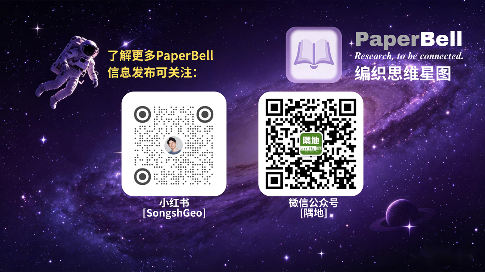

谢谢你使用 `PaperBell`。如果你看到了这里，或许你对后面的碎碎念感兴趣。

## 关于团队

我们是一帮因为共同愿景而组建的年轻团队。 #TODO

## 关于创始人

> [!info]
> 👋 I'm Shuang Song, 🌍 A geographer who also travels.

我是[宋爽](https://songshgeo.com/)，PaperBell 项目的发起人与。得益于地理专业和学术工作的弹性时间，我去过不少地方，结识过有趣的人，做过很酷的事，让我能够**用地理学者的眼光认识世界的参差多态**。如果你对我的个人/学术经历感兴趣，可以[点击这里](https://songshgeo.com/)访问我的个人主页

除了我之外，这个项目正在吸纳更多贡献者，他们正在通过宣传、贡献代码、贡献想法等方式，为 `PaperBell` 项目贡献力量。如果你有兴趣加入我们团队，欢迎[通过邮件联系我们](mailto:PaperBell@songshgeo.com)

## 开放科学

创建这个库的初衷是为使用 Obsidian 进行科研生活管理的用户提供一些便利。作为一个科学家，我不喜欢重复造轮子，更喜欢新的知识与新的思想。我坚信，开放科学是科学研究的未来，也是科学研究的一种新范式。所以我开源了我每一个项目的代码，并创建了示例库 `PaperBell`，希望为推动开放科学贡献一份绵薄之力。

> [!warning]
> 本示例库开源，不等于所有功能能够免费使用：
> 
> 1. 请用户确保遵守开源协议，不要轻易打包和分发我们的项目。我们团队有专门的法务，对 `PaperBell` 的核心功能也申请了专利保护，对于情节严重的侵权行为，我们将予以追究。
> 2. 维护项目的持续运营存在成本，因此我们对随本仓库分发的部分插件功能进行订阅制收费。核心原则是 ”工作流免费分享，部分自动化脚本需要付费“（详情可见[核心设计理念](../01-产品介绍/01-核心设计理念.md)）。

## 🤝 支持我们  #TODO

> [!warning]
> 对还没有工作收入的学生党，我不建议花钱。PaperBell 的免费功能已经足够，尚不确定是否终身适用于以学术为志业的学生。你可以[写一封邮件](mailto:PaperBell@songshgeo.com)告诉我们，这个项目对你有帮助，并且帮我们在社交媒体上宣传，对我们来说就是极大的鼓励了。

项目的维护占用了我们团队开发者大量的时间。如果您有意愿和一定的经济能力，欢迎通过以下方式支持我们：

- 通过 “Buy me a coffee” 的方式打赏我们
- 购买PaperBell 专属插件 的付费 Pro 版本
- 在发表的学术论文里对我们进行致谢

最后，我们为 `PaperBell` 项目创建了一个微信交流社群，欢迎交流任何关于学术生活的感想，欢迎在[我们的小红书账号](https://www.xiaohongshu.com/user/profile/5b85635d350cbf00015c8e9f?xsec_token=YBANMTYpb2tLUJjSdtcnOVVG7_88s5p7i0XMqUVoCbyN0=&xsec_source=app_share&xhsshare=CopyLink&appuid=5b85635d350cbf00015c8e9f&apptime=1737471861&share_id=7ab450ee8ece4d5ba9fa76cf174f2627) 关注我们。

---

[返回 FAQ 与问题反馈](index.md) · [下一篇：问题反馈](02-问题反馈.md)
